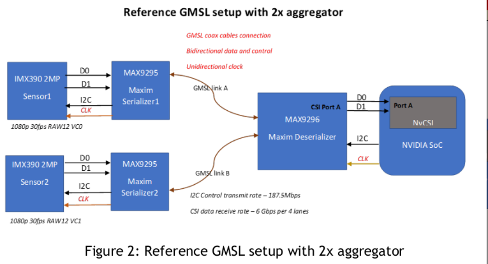
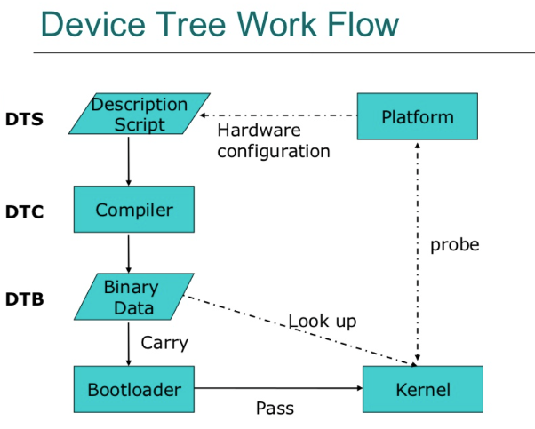
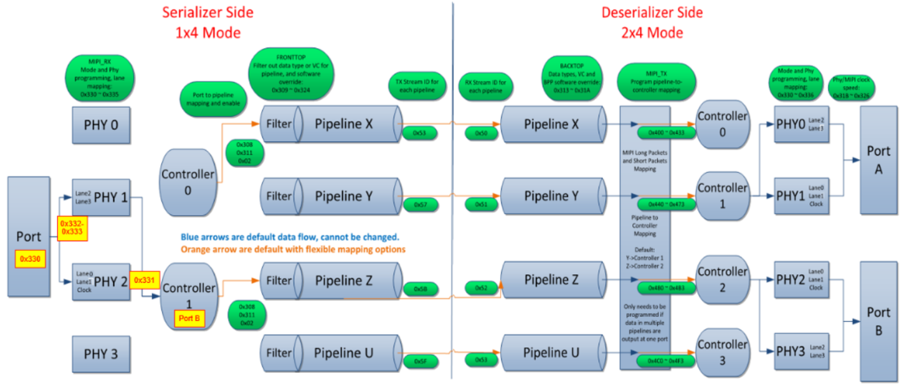
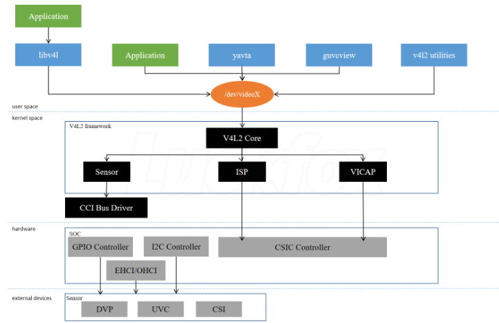

# Camera Driver Developpment Tutorial

As a software engineer, I have completed the development of a camera driver as a beginner on both the Raspberry Pi and Jetson platforms. I want to write a detailed tutorial to guide beginners on how to develop a camera driver on SoC platforms, helping them achieve camera usage freedom. This tutorial is particularly suitable for beginners, even for those with no prior knowledge of driver development or further camera development. The article will provide an understanding of the step-by-step process of developing a camera driver from scratch, as well as important considerations during camera usage.

For those interested in using cameras for tasks like robotics or deep learning-based detection, this tutorial will also offer valuable insights. It will help you understand how to set up the camera for real-time image capture, which can be applied to projects such as object detection, autonomous navigation, or other AI-driven tasks. Additionally, I will include examples and source code for getting the IMX390C and IMX490C working on Jetson and Raspberry Pi.

# Content
* 0. How a camera work
* 1. The Steps of the Camera Driver Developpment
* 2. The Best practice on Jetson Orin nano and Raspberry Pi 4B
* 3. Demo & Annexes

# 0. How a camera work
* With the picture below you could find exactly the pipeline of a camera. If we want to get the image stream from the SoC. The hardwares pass throught from input to output are `Lens -> Sensor -> ISP(Optional on Camera or On SoC) -> Ser/Des -> SoC`.

* The Sensor, ISP, Ser/Des could control or config by I2C and get the forward data by MIPI, which is the logic of the camera driver.

# 1. The Steps of the Camera Driver Developpment

## 1.1. Device Tree Config

Config & Compile the `Device Tree`. In computing, a devicetree (also written device tree) is a data structure describing the hardware components of a particular computer so that the operating system's kernel can use and manage those components, including the CPU or CPUs, the memory, the buses and the integrated peripherals.

With successfully build the dts, you may get a dtb file.
* For Jetson Platform replace the `/boot/dtb/tegra**.dtb`
* For Raspberry-pi put the file in `/boot/overlays/` and modify the `/boot/config.txt`

No need other changes, i2c command could be used to check whether the device(sensor, ser/des) appears on the I2C Bus.
`i2cdetect -l` to check if the config success.
`i2cdetect -r [channel_number]` to verify if the device(sensor, ser/des) appears on the I2C BUS.

## 1.2. Check the Register Config

The example codes `camera_init.c` could be used, which can be compiled with `gcc -o camera_init camera_init.c`, to check if the register configuration is correct. 

Normally, you could get an camera activate file from the Saller or with some specialized software. The picture below is an explaination of the mechanism of `max9295a to max9296a` register configuration.

## 1.3. Camera Driver

After verify the register configuration is correct. The driver code can be write with a framework called `v4l2`. v4l2(video for linux) is a kernal space framework, which helps us to build the camera drivers easily.

# 2. The Best practice on Jetson Orin nano and Raspberry Pi 4B

# 3. Demo & Annexes
