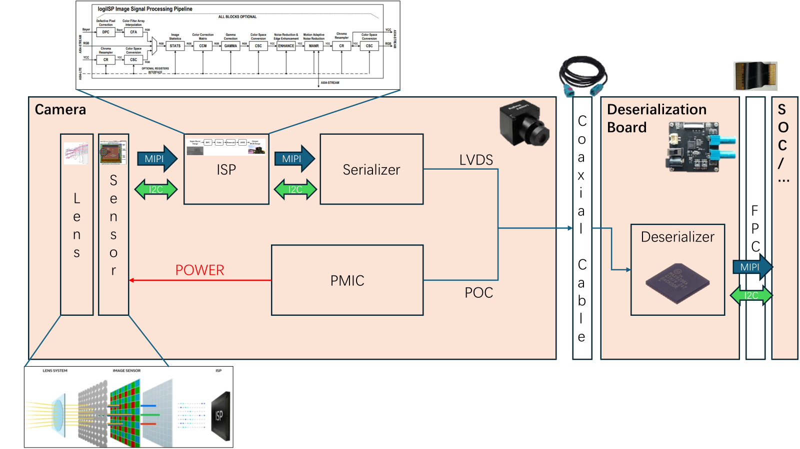

# Camera Driver Developpment Tutorial

As a software engineer, I have completed the development of a camera driver as a beginner on both the Raspberry Pi and Jetson platforms. I want to write a detailed tutorial to guide beginners on how to develop a camera driver on SoC platforms, helping them achieve camera usage freedom. This tutorial is particularly suitable for beginners, even for those with no prior knowledge of driver development or further camera development. The article will provide an understanding of the step-by-step process of developing a camera driver from scratch, as well as important considerations during camera usage.

For those interested in using cameras for tasks like robotics or deep learning-based detection, this tutorial will also offer valuable insights. It will help you understand how to set up the camera for real-time image capture, which can be applied to projects such as object detection, autonomous navigation, or other AI-driven tasks. Additionally, I will include examples and source code for getting the IMX390C and IMX490C working on Jetson and Raspberry Pi.

# Content
* 0. How a camera work
* 1. The Steps of the Camera Driver Developpment
* 2. The Best practice on Jetson Orin nano and Raspberry Pi 4B
* 3. Demo & Annexes

# 0. How a camera work

# 1. The Steps of the Camera Driver Developpment

# 2. The Best practice on Jetson Orin nano and Raspberry Pi 4B

# 3. Demo & Annexes
